# USER_GUIDE — ClipKeep

ClipKeep 0.1.1-beta の使い方を、起動から順に説明します。解凍から最初の Keep までを短く試すなら [QUICKSTART.md](./QUICKSTART.md) を参照してください。

ClipKeep でできることは大きく2つです。動画をタイルで**眺めて探すこと**（4章）と、気になった瞬間を **Keep して残すこと**（5章）です。

---

## 1. はじめに — 起動と初期設定

### 1.1 置き方（フォルダごと持ち運べる）

ダウンロードした ZIP を**空のフォルダ**に解凍し、`clipkeep.exe` を起動します。インストールは要りません。

ZIP には次のものが入っています。どれも消さずに、同じフォルダに置いたままにしてください。

- `clipkeep.exe`
- `clipkeep-mcp.exe`
- `VideoTileKunPipeline`
- `BUILD-INFO.txt`

起動すると、同じフォルダに次のものが作られます。

| 名前 | 中身 |
|---|---|
| `settings.json` | アプリの設定 |
| `ClipKeepData` | ライブラリ（登録した動画の情報・タイル・Keep） |
| `ClipKeepWebView` | 画面の表示設定 |
| `ClipKeepTools` | 取得したモデルと外部ツール（ffprobe / ffmpeg） |

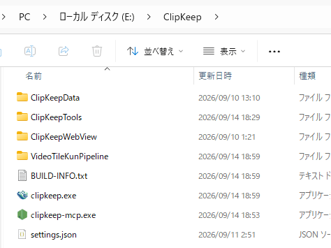

- **動画ファイルは移動もコピーもしません。** 元のフォルダに置いたまま参照します
- **フォルダごと別の場所や別の PC へ移せます。** 移した先でも同じライブラリが開きます
- ライセンスは PC ごとに認証します。別の PC へ移したら、その PC で認証し直してください（[9章](#9-プランとライセンス)）

### 1.2 初期設定（5 ステップ）

初めて起動すると **「初期設定」** が開きます。各ステップの内容はその場で保存されるので、**「次へ」** で進むだけで構いません。

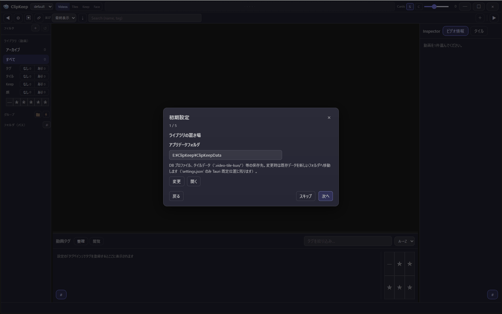

1. **ライブラリの置き場** — **「アプリデータフォルダ」** を確認します。既定は exe と同じフォルダの `ClipKeepData` です。**「変更」** を選ぶと、データごと新しいフォルダへ移します
2. **モデル・外部ツールの保存先** — 既定は exe と同じフォルダの `ClipKeepTools` です
3. **外部ツール** — 取り込みには ffprobe が必要です。**「未検出」** と出ていたら **「インストール」** を押します。手元にある実行ファイルを使うなら **「PATH から探す」** か **「参照…」** で指定します
4. **取り込みの設定** — 動画のフォルダを **「フォルダを追加」** で監視フォルダに登録できます。**「サムネイルサイズ（長辺 px）」** は後から変えると全タイルの作り直しになるので、ここで決めておきます
5. **案内** — **「検索用モデル（CLIP）」** を今取得するか後にするかを選びます。ライセンスキーをお持ちなら **「ライセンスキーを管理…」** から認証できます

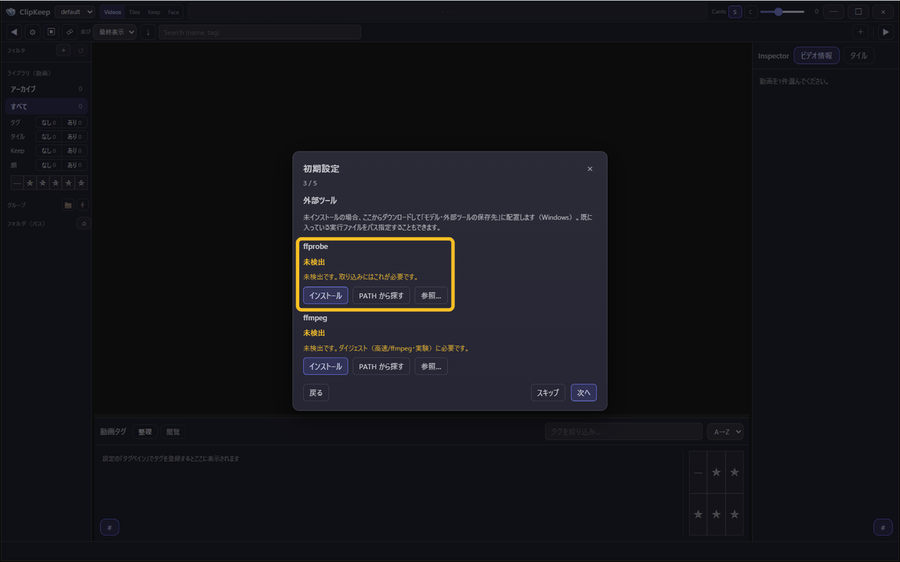

**「完了」** を押したとき、4 で監視フォルダを登録していれば、今すぐ取り込むかを尋ねられます。

**「スキップ」**、右上の **「×」**、Esc のどれで閉じても、次からは初期設定は出ません。もう一度開くには、設定 → **「一般」** → **「基本」** の **「初期設定をやり直す」** を押します。

---

## 2. 画面の見取り図

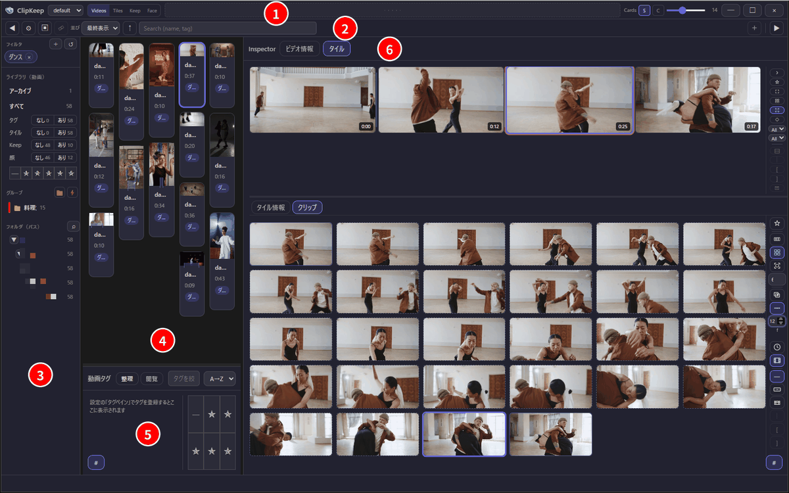

| 場所 | 役割 |
|---|---|
| ① タイトルバー | 表示モードの切り替え（**Videos** / **Tiles** / **Keep** / **Face**）、カードの大きさ（**Cards**） |
| ② ツールバー | 設定（歯車）、ホバープレビューとカードアニメのオン・オフ、並び順、検索欄 **「Search (name, tag)」**、右端にワークスペース（[8章](#ワークスペース画面の構成を保存して呼び出す)） |
| ③ 左のサイドバー | フィルタ、**「すべて」** と **「アーカイブ」**、グループ、フォルダツリー |
| ④ 中央 | 動画・タイル・Keep のカード一覧 |
| ⑤ 下のタグペイン | タグと評価の一覧。カードをドロップして付けられます |
| ⑥ 右のインスペクタ | 選んだ動画の **「ビデオ情報」** と **「タイル」**。下に **「タイル情報」** と **「クリップ」** |

サイドバー・インスペクタ・タグペインは隠せます。境目をドラッグすると幅や高さを変えられます。

---

## 3. 動画を取り込む

取り込みの方法は2つです。どちらも動画ファイルは元の場所のまま登録されます。

### 3.1 ドラッグ＆ドロップ

動画ファイルかフォルダを ClipKeep のウィンドウにドロップします。フォルダは中のフォルダまでたどって動画を探します。

対象の形式は mp4 / m4v / webm / mkv / mov / avi / wmv / flv / mpeg / mpg です。同じ動画がすでに登録されていれば登録をとばします。

### 3.2 監視フォルダ

動画を置くフォルダが決まっているなら、監視フォルダに登録しておくと、増えた動画を取り込めます。

設定 → **「一般」** → **「DB/システム」** の **「監視フォルダ」** で設定します。

- **「フォルダを追加」** — 監視するフォルダを登録します
- **「監視フォルダをチェック」** — 登録したフォルダを今すぐ調べて取り込みます
- **「アプリ起動中は OS 監視で増分取り込み」** — アプリが起動している間に増えた動画を取り込みます
- **「起動時に自動チェック（フル走査）」** — 起動するたびにフォルダ全体を調べます

### 3.3 タイル生成とバックグラウンド進捗

取り込んだ動画には、フレームからタイルが作られます。タイルは動画を一定の間隔で区切ったもので、枚数は動画の長さで決まります。タイルの生成はバックグラウンドで進むので、待たずに使い始められます。進み具合は画面の一番下に出ます。

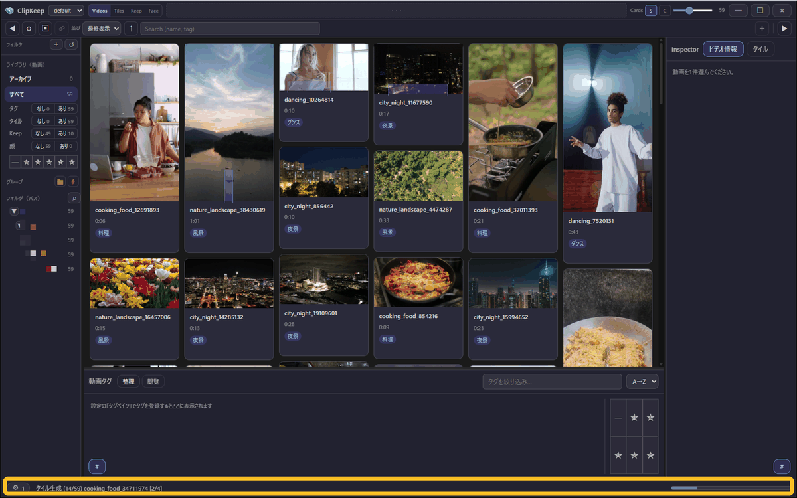

- タイルがまだできていない動画のカードには **「タイルなし」** と出ます
- いつタイルを作るかは、設定 → **「一般」** → **「タイル生成」** の **「自動生成」** で選べます。既定は **「インポート時にタイルを自動生成」** です
- タイルの枚数は、設定 → **「一般」** → **「タイル生成」** の **「グリッドと抽出」** で変えられます

無料プランで登録できる動画は 30 本までです。上限に達すると、それ以降の取り込みはそこで止まります（[9章](#9-プランとライセンス)）。

---

## 4. タイルで眺めて探す

### 4.1 タイルカタログとホバープレビュー

タイトルバーで **Tiles** を選ぶと、すべての動画のタイルが並びます。**Videos** では動画ごとのカードが並びます。

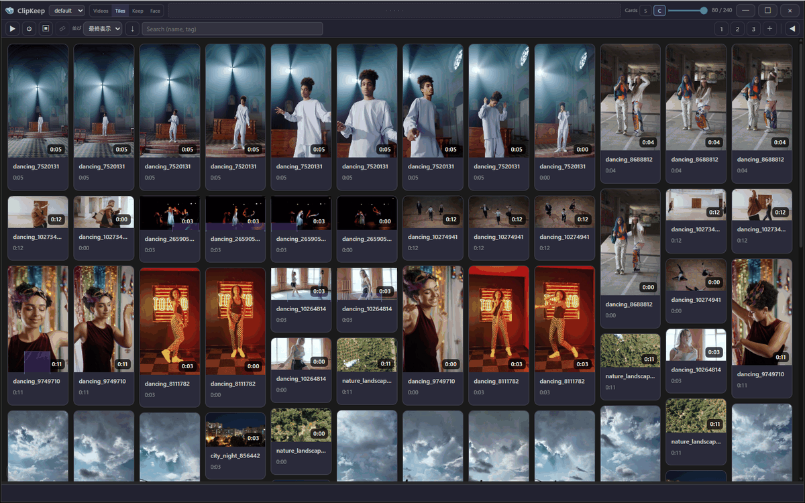

- **ホバープレビュー** — カードにマウスを乗せると、その場で再生されます。表示中は Space で再生と一時停止、Ctrl＋ホイールで拡大率、Shift＋ホイールで再生速度、Alt＋ホイールで音量を変えられます。細かい設定は設定 → **「一般」** → **「ホバープレビュー」**
- **カードの大きさ** — タイトルバーの **Cards** で、**S**（大きさで指定）か **C**（列数で指定）を選び、スライダーで変えます
- **並び順** — ツールバーの並び順で、最終表示・タイトル・長さ・評価などから選びます。右の矢印で昇順と降順を切り替えます

### 4.2 インスペクタとタイルグリッド

カードを1つ選ぶと、右のインスペクタにその動画の情報が出ます。

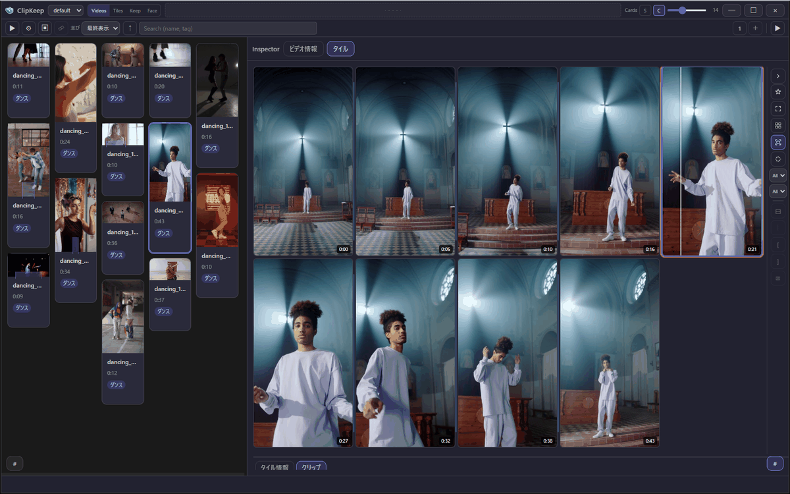

- **「ビデオ情報」** — ファイル名・場所・長さ・解像度など
- **「タイル」** — その動画のタイルがグリッドで並びます。Keep の一覧が出ているときは、右端のボタンでタイルグリッドに切り替えます。並べ方は **「サイズ指定」**・**「列数指定」**・**「フィット」** から選べます

タイルをクリックすると、その位置へ移動して下の **「クリップ」** にそのタイルの範囲が出ます。Ctrl や Shift を押しながらクリックすると、複数選べます。

### 4.3 フォルダツリー

左のサイドバーのフォルダツリーで、フォルダをクリックすると、そのフォルダ（中のフォルダを含む）の動画だけに絞り込めます。Ctrl を押しながらクリックすると、フォルダを足して絞り込めます。

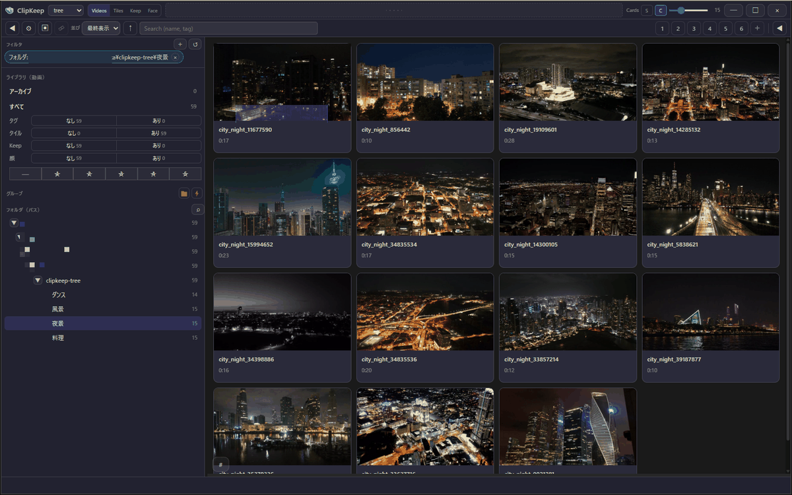

### 4.4 タグ・レーティング・フィルタ・検索

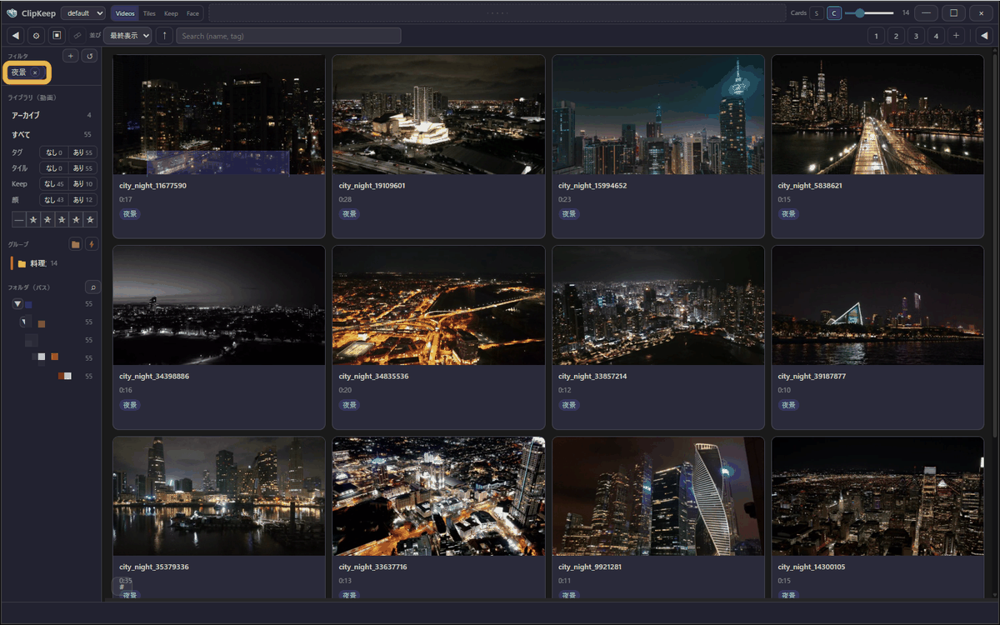

- **検索欄** — **「Search (name, tag)」** に名前やタグを入れて Enter を押すと、絞り込みの条件（チップ）になります。チップを重ねるとすべてに当てはまるものに絞られます。チップは **「×」** で外せます
- **フィルタ** — サイドバーの **「フィルタ」** の＋から、タグ・評価・長さ・更新日・解像度・タイル数などの条件を足せます
- **なし / あり** — サイドバーの **「タグ」** **「タイル」** **「Keep」** **「顔」** ごとに、付いていないもの・付いているものだけを表示できます
- **タグを付ける** — カードを右クリックして **「タグ管理」** を選ぶか、下のタグペインのタグへカードをドラッグします。タグペインに出すタグは、設定 → **「一般」** → **「タグペイン」** で選びます
- **評価を付ける** — カードを右クリックして **「評価…」** を選ぶか、タグペインの★へカードをドラッグします

### 4.5 グループ

好きな動画やタイルを、名前を付けたグループにまとめられます。

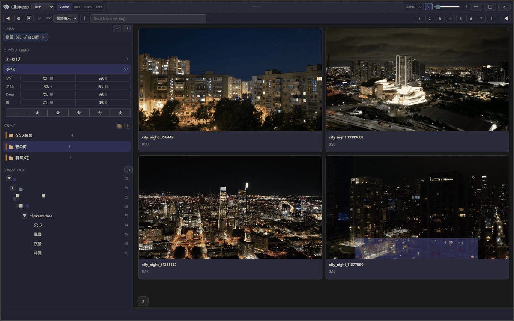

- **作る** — サイドバーの **「グループ」** の見出しの横にある **「手動グループを作成」** のボタンを押し、名前を入れて **「Create」** を押します。空のグループができます
- **入れる** — カードを選んで右クリックし、**「グループ管理」** を選びます。一覧でグループを押すと、選んだカードが入ります。もう一度押すと外れます
- **開く** — サイドバーのグループを押すと、そのグループの動画だけが中央に並びます

**「グループ管理」** の窓で名前を入れて Enter を押しても、新しいグループを作れます。ただし、選んでいたカードはまだ入っていません。作ったグループを一覧で押して入れます。

見出しの横の **「スマートグループを作成」** は、今の絞り込みの条件をそのまま条件にしたグループを作ります。条件に合う動画が自動で集まります。

---

## 5. 瞬間を Keep する

Keep は、動画の中の範囲を **Keep タイル**として残す機能です。元の動画とは別に、瞬間のコレクションとして一覧できます。

### 5.1 クリップエディタで範囲を決める

インスペクタでタイルを選ぶと、下の **「クリップ」** に、そのタイルの範囲のフレームが並びます。

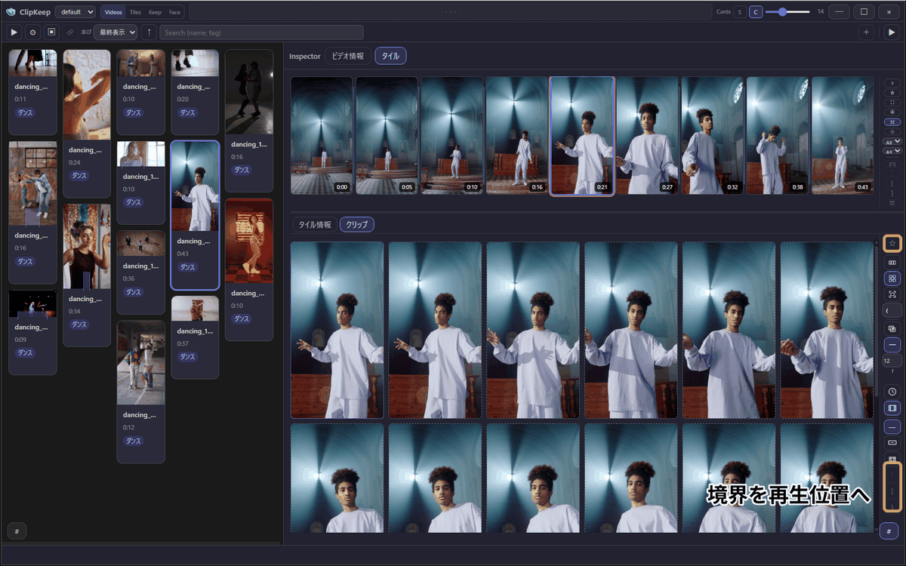

- 並べ方は、右端のボタンで **「一列（横スクロール）」**・**「グリッド（列数固定）」**・**「フィット（表示域に収める）」** から選べます
- 範囲の中をどのくらい細かく並べるかは、枚数で指定するか、間隔で指定します
- 範囲の境界を動かすときは、先に再生位置を合わせます。`[` で前の境界を、`]` で後ろの境界を再生位置へ移動します。`┊` は再生位置でタイルを分割します
- 並んだフレームを選んで Keep のボタンを押すと、選んだ範囲が Keep に保存されます。続けて選んだフレームは 1 件の Keep にまとまります

### 5.2 プレーヤーの見た目ごと Keep する

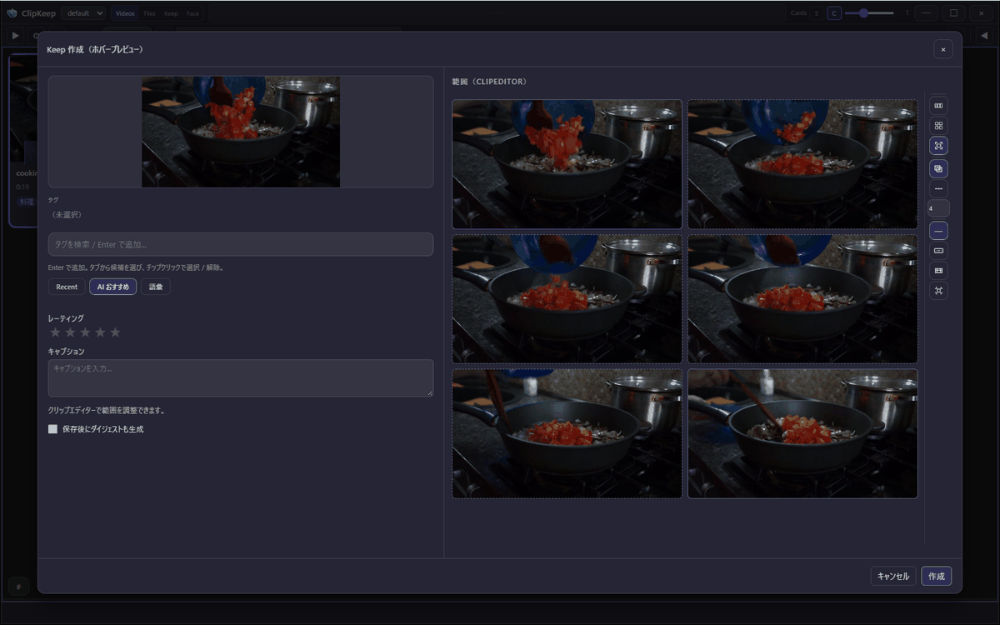

Keep を作る方法は2つです。

- **ホバープレビューから** — プレビューを表示している間に **S** を押すとすぐに Keep（**クイックキープ**）、**K** を押すと **「Keep 作成（ホバープレビュー）」** のダイアログが開きます
- **プレーヤーから** — 範囲の繰り返し（A–B）をオンにすると、**「クイックキープ (S)」** と **「Keep ダイアログ (K)」** のボタンが出ます

ダイアログでは、**「タグ」**・**「レーティング」**・**「キャプション」** を入れて **「作成」** を押します。**「保存後にダイジェストも生成」** にチェックを入れると、保存と同時にダイジェストを作ります。

プレーヤーで拡大・移動・回転した見た目は、そのまま Keep に残ります。Ctrl＋ホイールで拡大、Ctrl＋ドラッグで移動、**Q** / **E** で 15° ずつ回転します。

クイックキープで付けるタグや評価は、設定 → **「一般」** → **「クイックキープ」** で決めておけます。

### 5.3 Keep を集めて眺める

タイトルバーで **Keep** を選ぶと、作った Keep タイルが並びます。

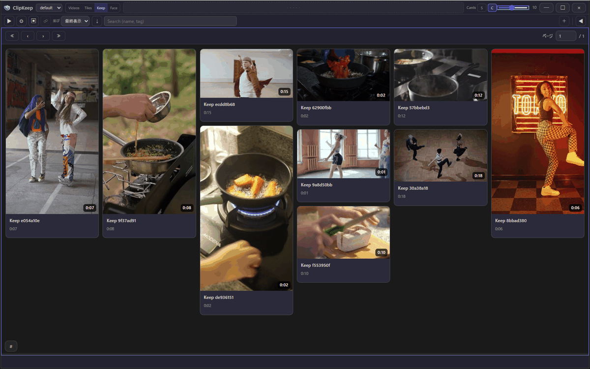

Keep もタグ・評価・グループ・フォルダツリーで絞り込めます。Keep を右クリックすると、アーカイブへ移したり削除したりできます。

### 5.4 ダイジェスト

ダイジェストは、Keep の範囲から作る短いアニメーションです。

- Keep を保存するときに作るか、Keep を右クリックして **「ダイジェストを生成」** で作ります。消すときは **「ダイジェストを削除」**
- ツールバーの **「カードアニメ（ダイジェスト）」** をオンにすると、表示中のカードでダイジェストが繰り返し再生されます
- 長さやフレームレートは、設定 → **「一般」** → **「ダイジェスト」** で変えられます

### 5.5 書き出し（有料）

Keep した範囲を動画ファイルとして書き出せます。書き出しは有料プランの機能です（[9章](#9-プランとライセンス)）。

- Keep を右クリックして **「書き出し…」** を選びます
- **「個別に書き出し」** は1件ずつ別のファイルに、**「結合して 1 本に書き出し」** はつないで1本にします。画質や解像度、出力先を選んで **「書き出し」** を押します
- 個別のファイル名は、動画名に Keep のタイトル（無ければキャプションやタグ）を付けたものになります

無料プランで書き出しを選ぶと、**「書き出しは有料プラン限定の機能です。ライセンスを認証すると利用できます。」** と表示されます。

---

## 6. All-Access で使える機能（スキャン実験室）

スキャン実験室では、動画の中の顔・ポーズ・シーンの切れ目・話し声を検出して、あとから探せるようにします。検出は **All-Access（サブスク）のライセンス**で使えます。

動画を選んで右クリックし、**「スキャン実験室で開く」** を選びます。複数の動画をまとめて開けます。

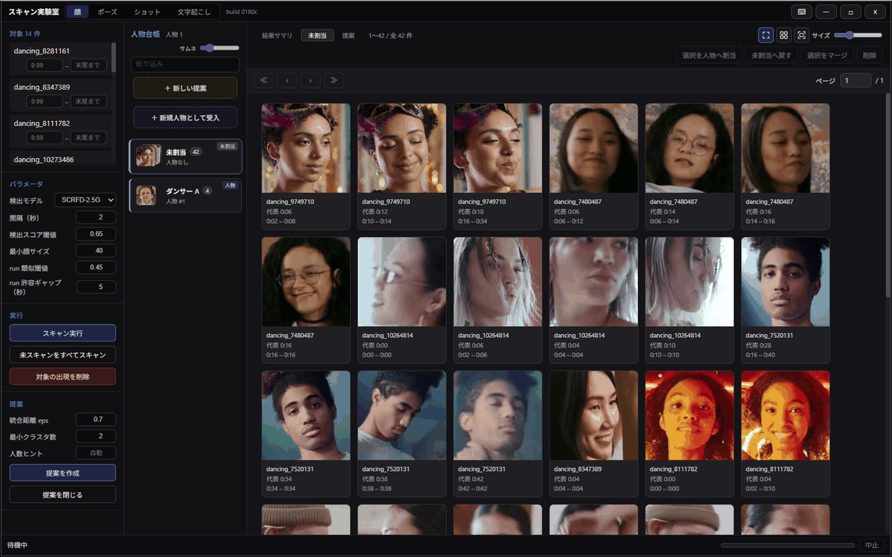

| タブ | できること |
|---|---|
| **「顔」** | 顔を検出し、同じ人物の顔をまとめて人物として登録します |
| **「ポーズ」** | 人のポーズを検出し、似たポーズを集めます |
| **「ショット」** | シーンの切れ目を検出し、場面ごとに区切ります（シーン検出） |
| **「文字起こし」** | 話し声を文字にします。**「字幕を書き出し」** で SRT / WebVTT に保存できます |

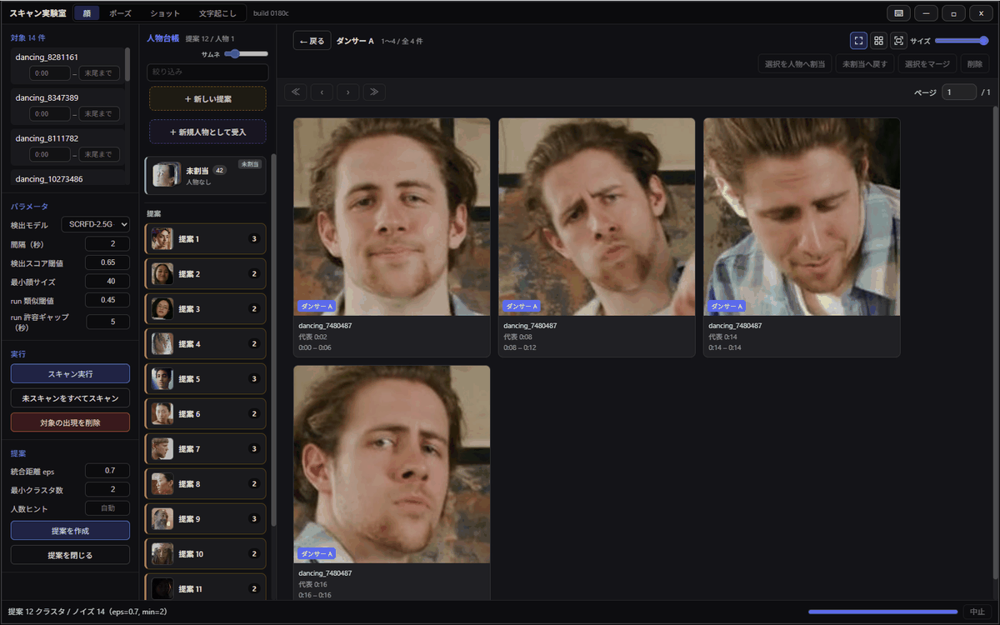

- 初めて実行するときは、検出に使うモデルを取得するか尋ねられます（**「モデルの取得」**）。取得したモデルは `ClipKeepTools` に入ります
- 顔タブでは、**「提案を作成」** で同じ人物らしい顔をまとめ、名前を付けて人物として登録します
- 登録した人物は、タイトルバーの **Face** で一覧できます。人物を選ぶと、その人物が出ている動画・タイル・Keep が並びます
- **「ショット」** タブで検出した切れ目に合わせてタイルを作り直すには、表の行を選んで **「タイルを作り直す…」** を選びます
- 字幕の書き出しと読み込みはライセンスがなくても使えます。翻訳は実験的な機能で、同じ文言の繰り返しや意味の取り違えが起きることがあります

All-Access のライセンスがないと、**「この機能はサブスクで解錠されます」** と表示されます。

---

## 7. 片付け — アーカイブ

使わなくなった動画は、消さずにアーカイブへ移せます。

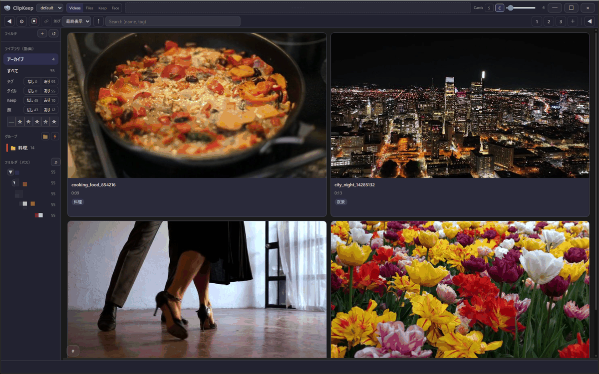

| 操作 | 何が起きるか |
|---|---|
| **「アーカイブへ移動…」** | 一覧から外れます。いつでも **「アーカイブから復元」** で戻せます |
| **「アーカイブを空にする…」** | アーカイブ内の動画のタイルと情報を削除します。元の動画ファイルは残ります |
| **「元動画をWindowsのゴミ箱へ → ライブラリから削除…」** | 元の動画ファイルをゴミ箱へ移し、ライブラリからも削除します |

- アーカイブの中身は、サイドバーの **「アーカイブ」** で見られます
- アーカイブ中の動画は、無料プランの本数に数えません
- アーカイブした動画から作った Keep は、Keep の一覧に残ります

---

## 8. 設定

ツールバーの歯車で設定を開きます。変更はすぐに反映されます。

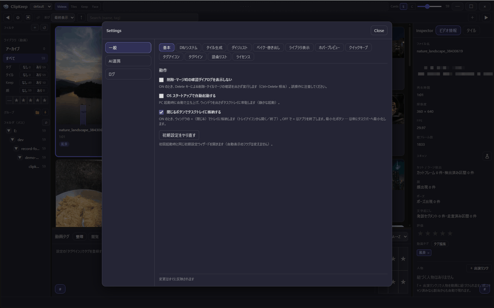

- **「一般」** — 動作・取り込み・タイル生成・ダイジェスト・表示・ホバープレビュー・クイックキープ・タグ・ライセンスなど
- **「AI連携」** — 意味検索や顔認識に使うモデル
- **「ログ」** — アプリのログ。不具合を報告するときに使います

よく使う項目:

- **「閉じるボタンでタスクトレイに格納する」**（**「基本」**）— オンのとき、ウィンドウの × でタスクトレイに格納されます。終了するときはトレイのアイコンから終了します。オフにすると × で終了します
- **「OS スタートアップで自動起動する」**（**「基本」**）— PC の起動時に、ウィンドウを出さずにタスクトレイで起動します

### ライブラリの場所

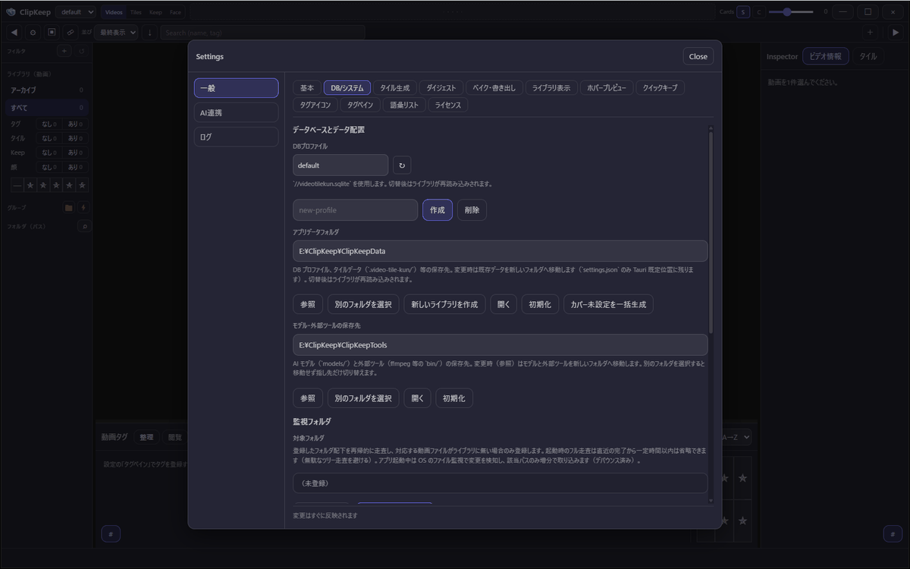

**「DB/システム」** で、ライブラリの場所を変えられます。

- **「参照」** — 今のデータを新しいフォルダへ**移して**、そこを使います
- **「別のフォルダを選択」** — データは移さず、使うフォルダだけを切り替えます
- **「新しいライブラリを作成」** — 選んだフォルダに空のライブラリを作り、そちらに切り替えます

同じ画面で **DB プロファイル**を作ると、ライブラリを分けて使えます。無料プランで作れるプロファイルは 1 つまでです。

### ワークスペース（画面の構成を保存して呼び出す）

ペインの開閉と幅、カードの大きさ、インスペクタの幅とタブ、タイルグリッドとクリップエディタの大きさを、名前を付けて保存できます。作業に合わせて組んだ画面に、アイコン1つで戻れます。

- **保存する** — 画面を組んでから、ツールバー右端の **「現在のレイアウトをワークスペースとして登録」** のボタンを押します。**「ワークスペースを登録」** で **「名前」** を入れ、必要なら **「アイコン（未指定なら番号を表示）」** を選んで **「登録」** を押します
- **呼び出す** — ツールバーに並んだアイコンを押します
- **表示モードも戻す** — 登録するときに **「モードも含める（ビデオ／タイル／キープ／フェイス）」** にチェックを入れておくと、呼び出したときに表示モードも切り替わります
- **直す・消す** — アイコンを右クリックして、**「現在の状態で上書き」**・**「名前・アイコンを編集…」**・**「削除」** から選びます。アイコンはドラッグで並べ替えられます

選んでいるカード、絞り込みの条件、スクロールの位置は保存されません。

---

## 9. プランとライセンス

### 無料プラン

期限なしで、次の数まで使えます。

- 動画 30 本
- Keep タイル 100 枚
- プロファイル 1 つ

上限を超えると、画面の上に「動画 31 本（無料プラン上限: 30 本） — 表示は制限内に絞られています」のような表示が出て、それ以降の登録や作成は止まります。**データは消えません。** 有料プランのライセンスを認証すると、そのまま全件に戻れます。

### 有料で使えるもの

有料プランは、買い切りと All-Access の2つです。いま購入できるのは All-Access です。

| | 買い切り | All-Access |
|---|---|---|
| 動画・Keep・プロファイルの上限 | なし | なし |
| 書き出し（[5.5](#55-書き出し有料)） | ✓ | ✓ |
| スキャン実験室の顔・ポーズ・シーン検出・文字起こし（[6章](#6-all-access-で使える機能スキャン実験室)） | | ✓ |

料金は [ハブの料金ページ](https://shinosuke-site.vercel.app/pricing.html) を参照してください。

### ライセンスキーを認証する

設定 → **「一般」** → **「ライセンス」** の **「ライセンスキーを管理…」** を押すと、**「ライセンス管理 — ClipKeep」** が開きます。

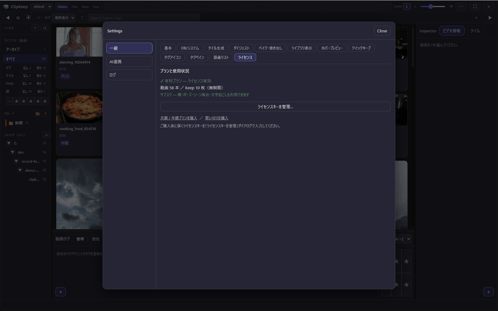

- **「ライセンスキーを入力」** にキーを貼り付けて **「認証する」** を押します
- 別の PC で使うために今の PC の認証を外すときは **「このデバイスのライセンスを解除」** を押します
- 購入は **「月額 / 年額プランを購入」**、購読と請求の管理は **「サブスク・請求の管理（カスタマーポータル）」** から開けます

ライセンスは 24 時間ごとにインターネットで確かめます。All-Access は、オフラインでも最後に確かめてから 30 日間使えます。

---

## 10. つまずいたとき

### 「ライブラリが見つかりません」と出て起動しない

ライブラリのフォルダが見つからないときに出ます。外付けドライブにライブラリを置いている場合は、ドライブをつなぐと自動で再接続します。

- **「再試行」** — もう一度探します
- **「別のフォルダを選択」** — 別の場所にあるライブラリを選びます
- **「新しいライブラリを作成」** — 空のライブラリで始めます

### 初回起動で SmartScreen の警告が出る

ClipKeep は署名していないため、警告が出ることがあります。警告の画面で「詳細情報」を押し、出てきた「実行」を押すと起動できます。

### 動画を取り込めない・外部ツールが「未検出」

取り込みには ffprobe が必要です。設定 → **「一般」** → **「DB/システム」** の外部ツールで、**「インストール」** を押して取得するか、**「参照…」** で実行ファイルを指定します。**「状態」** で、どのファイルを使っているかを確かめられます。

### カードに「タイルなし」と出たまま

タイルの生成が終わっていません。生成はバックグラウンドで進み、終わると表示が消えます。すぐに作りたい動画は、右クリックして **「タイル生成」** を選びます。

### 上限のバナーが出た

無料プランの上限に達しています。[9章](#9-プランとライセンス) を参照してください。

### 解決しないとき

[SUPPORT.md](./SUPPORT.md) の窓口までご連絡ください。設定の **「ログ」** の内容を添えていただくと、原因を調べやすくなります。
